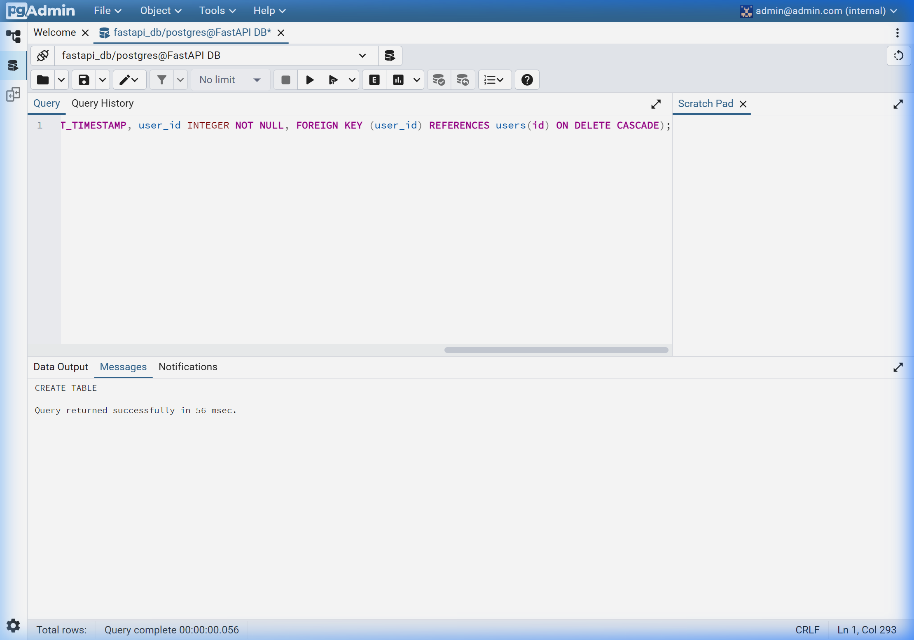
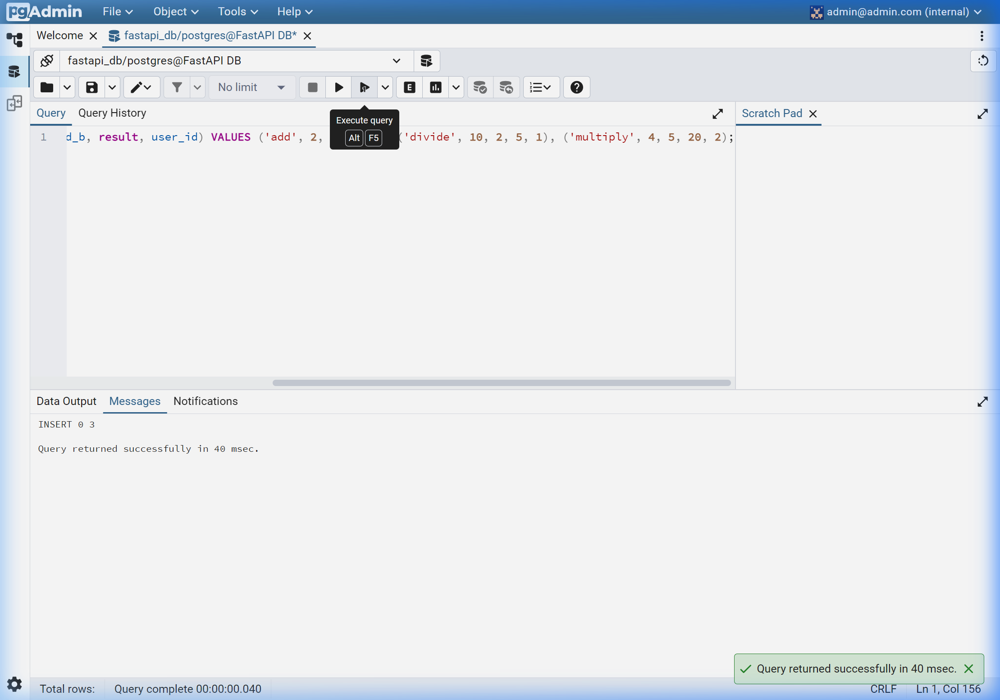
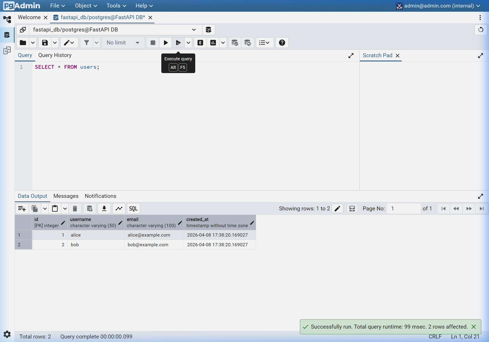
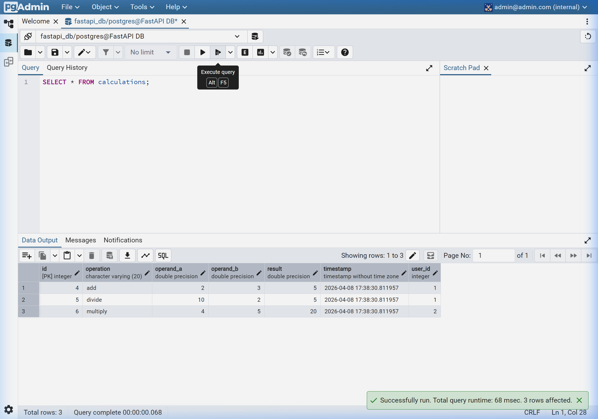
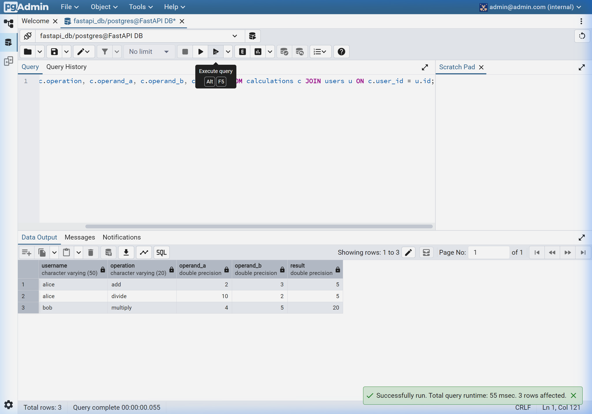
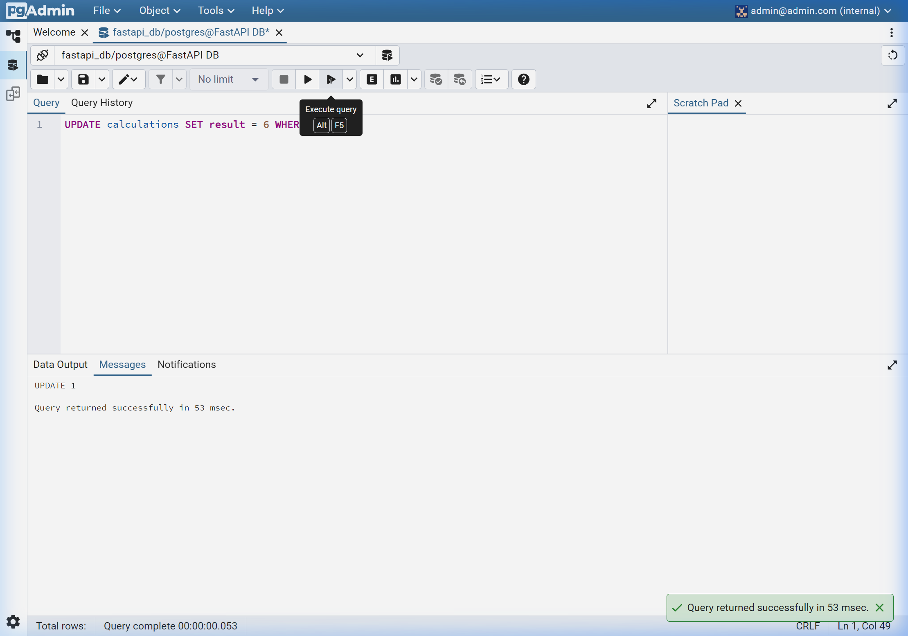
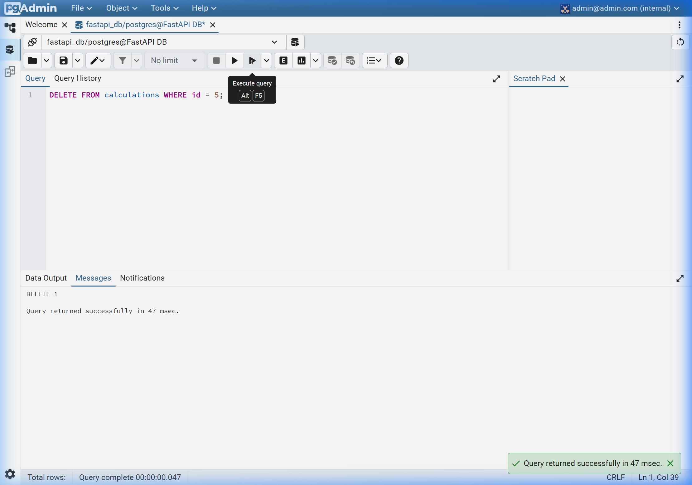

# SQL Database Integration — Assignment Documentation

This document compiles the execution results of the SQL steps performed in the pgAdmin environment for the FastAPI Calculator assignment.

## Environment Overview
- **FastAPI Service**: Running on port `8000`
- **PostgreSQL Database**: Running on port `5432`
- **pgAdmin Management**: Accessible at `http://localhost:5050`

## Repository Deliverables
The following files have been added to the repository to satisfy the assignment requirements:
- **`docker-compose.yml`**: Configures the FastAPI, PostgreSQL, and pgAdmin services.
- **`setup_db.sql`**: Contains all SQL commands for table creation, insertion, queries, updates, and deletions.
- **`pgadmin_servers.json`**: Enables auto-configuration of the `FastAPI DB` server in pgAdmin for immediate use.

---

## SQL Step Execution Results

### (A) Table Creation
The `users` and `calculations` tables were successfully created with appropriate primary and foreign keys.

*Caption: Tables created successfully using SERIAL primary keys and foreign key constraints.*

### (B) Data Insertion
Two users ('alice', 'bob') and three calculation records were inserted.

*Caption: Initial records inserted into both users and calculations tables.*

### (C) Data Retrieval
#### All Users

*Caption: Retrieving all users from the users table.*

#### All Calculations

*Caption: Retrieving all calculations from the calculations table.*

#### Joined Data

*Caption: A JOIN operation showing the relationship between users and their specific calculations.*

### (D) Record Update
The result of a calculation record was updated to demonstration manipulation of existing data.

*Caption: Successfully updated calculation result for record ID 4.*

### (E) Record Deletion
A calculation record was deleted to demonstrate data removal.

*Caption: Successfully deleted record demonstrating the DELETE operation.*

---

## Conclusion
All SQL operations were completed successfully within the containerized environment. The use of Docker Compose ensured all services were correctly networked and accessible.
